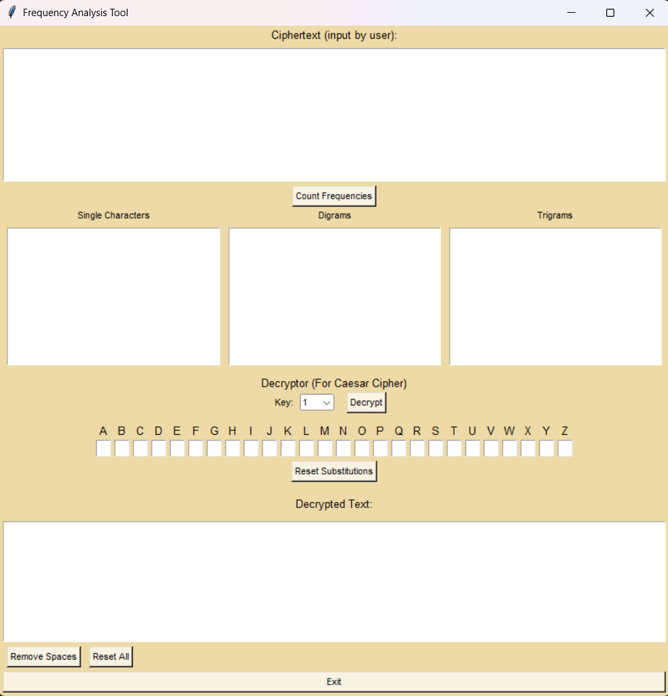

# Frequency Analysis Tool

## Description
Frequency Analysis Tool is a tool for frequency analysis and decryption of simple substitution ciphers. It supports frequency analysis of single characters, digrams, and trigrams, as well as Caesar cipher decryption.

## Requirements
- Python 3.x
- tkinter (comes with Python on most installations)

## Setup and Installation
1. Clone the repository:
   ```bash
   git clone https://github.com/jodayyy/Frequency-Analysis-Tool
   ```
2. Navigate into the project directory:
   ```bash
   cd Frequency-Analysis-Tool
   ```
3. (Optional) Create a virtual environment and activate it:
   ```bash
   python3 -m venv venv
   source venv/bin/activate  # On Windows use `venv\Scripts\activate`
   ```
4. Install the dependencies:
   ```bash
   pip install -r requirements.txt
   ```

## Usage
Run the app:
```bash
python app.py
```

## Features
- **Frequency Analysis:** Single characters, digrams, and trigrams.
- **Substitution Decryption:** Decrypt text using custom substitutions.
- **Caesar Cipher Decryption:** Choose a key for Caesar cipher decryption.

## UI

